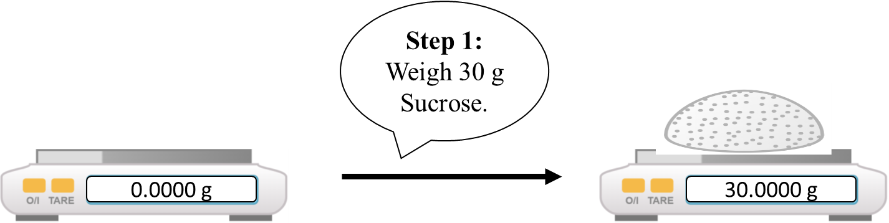
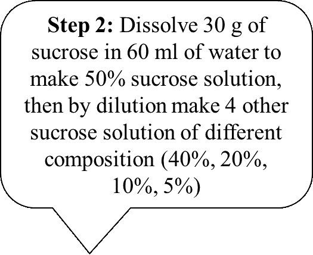
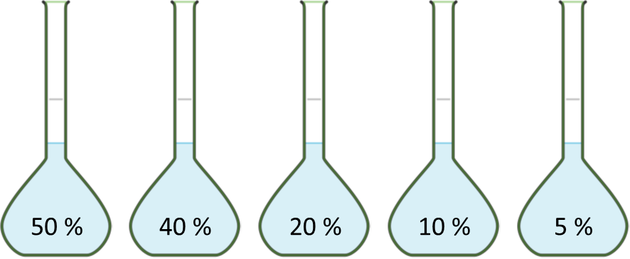
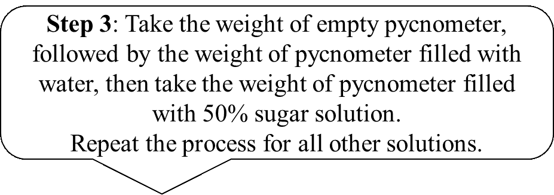
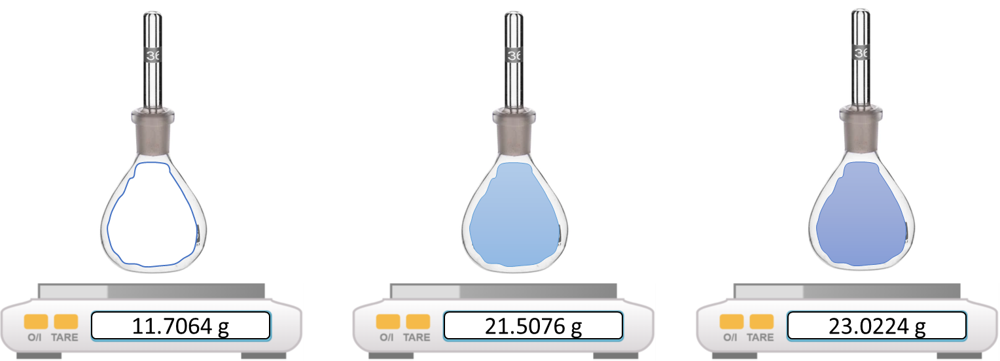
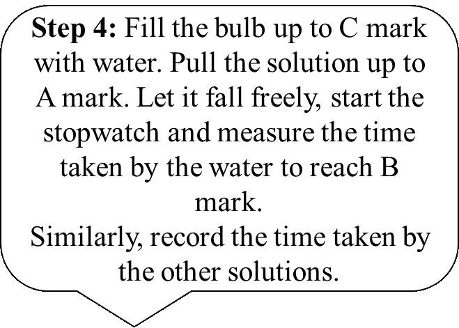
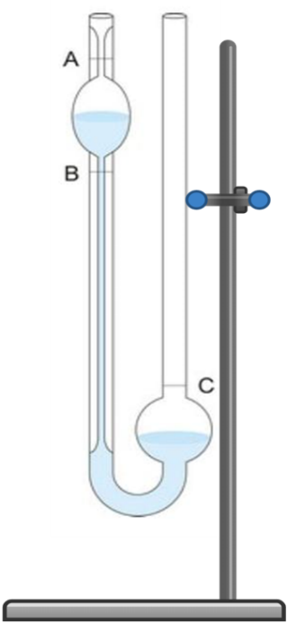
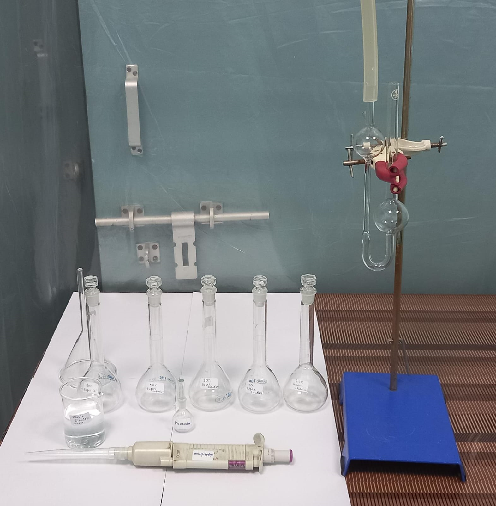

<b>Materials & Reagents Required</b>

1)	Ostwald viscometer. 
2)	Sucrose.
3)	Weighing balance 
4)	Pycnometer.
5)	Volumetric flask (250 mL) 
6)	Glass beaker (100 mL)
7)	Glass pipette (25 mL) 
8)	Distilled water.
9)	Clamp.

<h1> Procedure in laboratory diagram </h1>

| Sl. No| Materials| Weight of empty pycnometer| Weight of pycnometer + water| Weight of pycnometer + sugar solution| Density {(w3-w1)/(w2-w1)}
|--------| |-----------| |-----------| |----------| |-------------------------------------| |--------------------|
| 1   |          |             |            |                                               |                    |  
| 2   |          |             |            |                                               |                    |  
| 3   |          |             |            |                                               |                    |  
| 4   |          |             |            |                                               |                    |  
| 5   |          |             |            |                                               |                    |  
| 6   |          |             |            |                                               |                    |  

|Sl. No.| Materials(% of sugar soln)| Time of flow (.sec)| Average time (sec)| Viscosity|
|------| |---------| |----------------| |----------------| |---------------| |-------| |----------| |-----------| |-----------|
| 1 |              |                  |                  |                 |          |           |             |             |
| 2 |              |                  |                  |                 |          |           |             |             |
| 3 |            |                    |                  |            |                   |                       |
| 4 |              |                  |                  |                 |          |           |             |             |
| 5 |              |                  |                  |                 |          |           |             |             |
| 6 |              |                  |                  |                 |          |           |             |             |
| 7 |              |                  |                  |                 |          |           |             |             |

<h2>Procedure in laboratory<h2>

<b>Calculation and determination of the concentration of the unknown solution</b>
 
<h2>Density Calculation</h2>
 
|Sl. No.| Materials(% of sugar soln)| Weight of empty pycnometer(g)(w1)| Weight of pycnometer + water(g)(w2)| Weight of pycnometer+ sugar soln(g)(w3)| Density {(w3-w1)/(w2-w1)}(g/ml)
|---------| |----------| |-----------| |-----------| |--------------------| |-------------|
| 1 |     5	      |    11.7064	    | 21.5076	|    21.7254	      |     1.0222     |
| 2	|     10 |	11.7064 |  21.5076 |	21.8218	       |1.0320        | 
| 3	|     20 |  11.7064	 |  21.5076	|    22.2570	    |   1.0764|
| 4 |	40	 |11.7064	|21.5076	|     22.7159        |	1.1232   |
| 5 |	50	 |11.7064 | 21.5076  |  	23.0224	        |   1.1545   |
| 6	| Unknown |	11.7064 |	21.5076	|   22.4111	           | 1.0922  |

<h2>Viscosity Calculation</h2>
| Sl. No| Materials (% of sugar solution) | Time of flow (sec.)| Average time (sec)| | Viscosity|
|-------| |-----------| |------------| |-------------||------------| |---------| |--------| |---------| |--------|
|    1	|    5      |   123	    |  123.6667	  |           |
|		|   	|     124|        |1.0445  |
|		|  124	|	      |        |       |
|2     |        10  |   135 |    135.6667            |           |
|	   |   	        |   136 |           |     1.1571       |
|	   |	        |    136  |          |                 |
 

