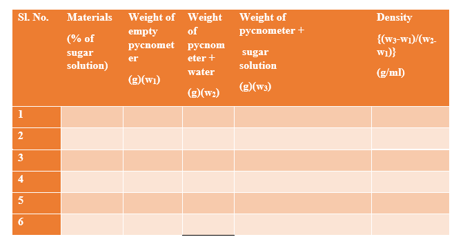
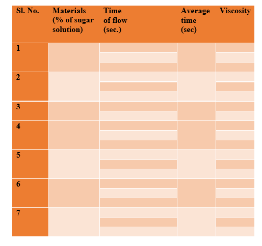

<b>Materials & Reagents Required</b> 

1)	Ostwald viscometer  
2)	Sucrose 
3)	Weighing balance  
4)	Pycnometer 
5)	Volumetric flask (250 mL)  
6)	Glass beaker (100 mL) 
7)	Glass pipette (25 mL)  
8)	Distilled water 
9)	Clamp  

<b> Procedure in laboratory diagram </b1> 
 
 
 
 
 
 
 
 
 
<b>Procedure in laboratory</b>  
 
<b>Calculation and determination of the concentration of the unknown solution</b> 
 
<b>Density Calculation</b> 
|Sl. No.| Materials(% of sugar soln)| Weight of empty pycnometer(g)(w1)| Weight of pycnometer + water(g)(w2)| Weight of pycnometer+ sugar soln(g)(w3)| Density {(w3-w1)/(w2-w1)}(g/ml) 
|Sl. No.|Materials(% of sugar solution)|Weight of empty pycnometer(g)(w1)|Weight of pycnometer + water (g)(w2)|Weight of pycnometer +sugar solution(g)(w3)|Density{w3-w1(w2-w1)}(g/ml)| 

|---------| ----------| -----------| -----------| --------------------| -------------|
| 1 |     5	      |    11.7064	    | 21.5076	|    21.7254	      |     1.0222     |
| 2	|     10 |	11.7064 |  21.5076 |	21.8218	       |1.0320        | 
| 3	|     20 |  11.7064	 |  21.5076	|    22.2570	    |   1.0764|
| 4 |	40	 |11.7064	|21.5076	|     22.7159        |	1.1232   |
| 5 |	50	 |11.7064 | 21.5076  |  	23.0224	        |   1.1545   |
| 6	| Unknown |	11.7064 |	21.5076	|   22.4111	           | 1.0922  |

<b>Viscosity Calculation</b> 
| Sl. No| Materials (% of sugar solution) | Time of flow (sec.)| Average time (sec)| | Viscosity|
|-------| |-----------| |------------| |-------------||------------| |---------| |--------| |---------| |--------|
|    1	|    5      |   123	    |  123.6667	  |           |
|		|   	|     124|        |1.0445  |
|		|  124	|	      |        |       |
|2     |        10  |   135 |    135.6667            |           |
|	   |   	        |   136 |           |     1.1571       |
|	   |	        |    136  |          |                 |
 

