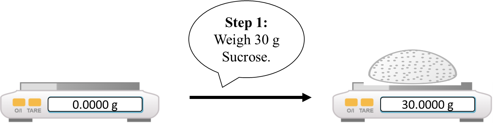
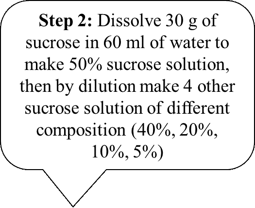
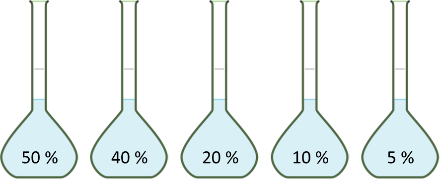
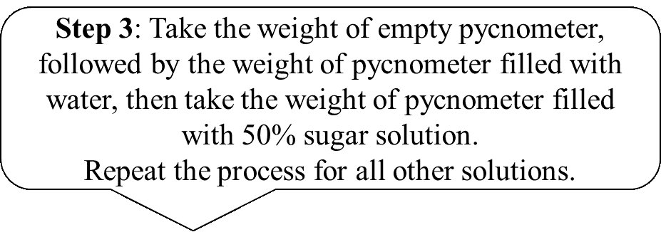
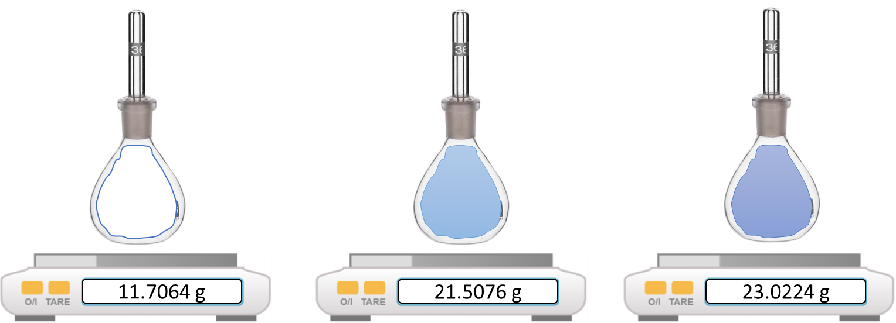
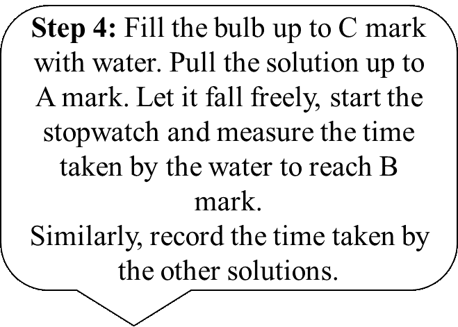
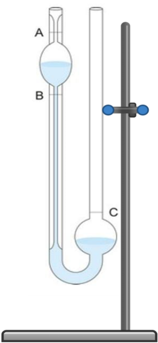
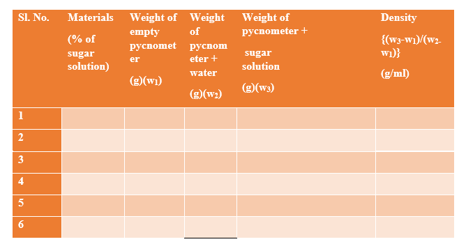
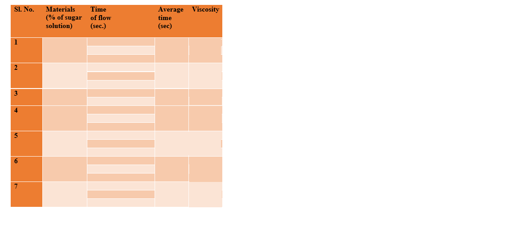
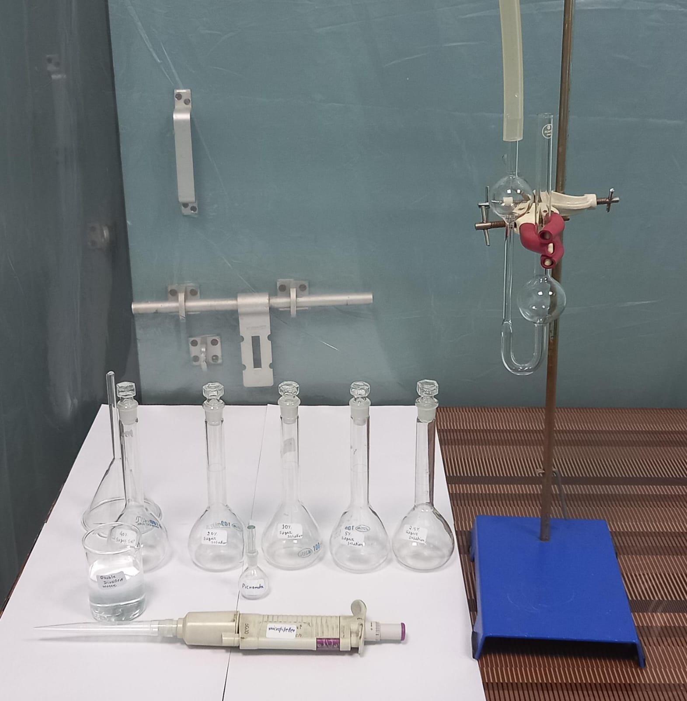

<b>Materials & Reagents Required</b> 

1)	Ostwald viscometer  
2)	Sucrose 
3)	Weighing balance  
4)	Pycnometer 
5)	Volumetric flask (250 mL)  
6)	Glass beaker (100 mL) 
7)	Glass pipette (25 mL)  
8)	Distilled water 
9)	Clamp  

<b> Procedure in laboratory diagram </b1> 
 
 
 
 
 
 
 
<!-- 
 -->
<b>Procedure in laboratory</b>  
 

