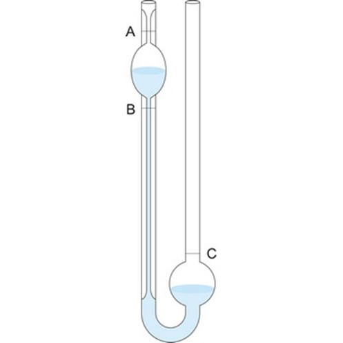

The coefficient of viscosity (η) of a liquid is defined as the tangential force per unit area required maintaining unit velocity gradient between two successive layers of a liquid, which are unit distance apart from each other .The unit of coefficient of viscosity is dyne s cm2 (poise). The co-efficient of viscosity of liquid can be determined by comparing with a liquid with known coefficient of viscosity using Poiseuille’s equation. 

η=(πPr4t)/8Vl			                 	(1)  

 

where V = volume of the liquid following through a capillary tube of length (l) in t second. The radius of the capillary is r cm and P is the driving pressure in dyne cm-2. P can be replaced by hρg, where h is the difference in height between the levels of the liquid in the two limbs, g = acceleration due to gravity and ρ is the density of the liquid. Now if the same capillary and the same volume of liquids are used, then for the two liquids the following equation can be deduced. 

η1/η2 =(ρ1t1)/(ρ2 t2 )				(2) 

In the above equation, ρ1 and ρ2 are the densities and  t1 and t2 are time of flow for the two liquids. Thus, if η2 is known, then by determining t1, t2, ρ1 and ρ2, η1 can be determined. 

In the present experiment we we will determine the relative viscosity in comparison of viscosity of water. So as η2 the viscosity of water and it’s density (ρ2) is known (from the chart), then by measuring t2 it’s time of flow and ρ1, t1 the density and time of flow of other liquids, viscosity can be calculated. The flow time of the liquids are determined using Oswald’s viscometer (Fig. 1.) and stopwatch. Densities are determined using specific gravity bottle.  

In this experiment several glucose solution in water is prepared having different concentration of sucrose among which one solution has unknown concentration. Using equation (2), coefficient of viscocity (η) is measured for each solution. Now η is plotted against the known concentration of sucrose that gives a straight line. From this plot the concentration of unknown solution is determined as the η value of this solution will be measured.

