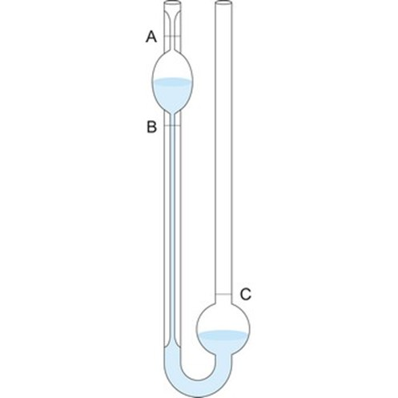

The coefficient of viscosity (η) of a liquid is defined as the tangential force per unit area required maintaining unit velocity gradient between two successive layers of a liquid, which are unit distance apart from each other. The unit of coefficient of viscosity is dyne-sec\cm2 (poise). The co-efficient of viscosity of liquid can be determined by comparing its coefficient of viscosity with the known coefficient of viscosity of a liquid. Generally, water is taken as the known liquid for comparison. As this method requires the comparison with another liquid, it is a relative method. In relative method for determination of coefficient of viscosity (η) of a liquid, Poiseuille’s equation can be used. Poiseuille’s equation 

η =πPr4t\8vl  

Where v=volume of the liquid following through a capillary tube of length (l) in ‘t’ sec. The radius of the tube is ‘r’ cm and ‘P’ is the driving pressure in dyne\cm2. P can be replaced by hρg, where h= difference in height between the levels of the liquid in the two limbs, g= acceleration due to gravity and ρ is the density of the liquid. Now if the same capillary and the same volume of liquids are used, then for the two liquids the following equation can be deduced.  

η1\η2=ρ1t1\ρ2t2 

Where, ρ1 and ρ2 are the densities and t1 and t2 are time of flow for the two liquids. So, if η2 is known, then by determining t1and t2, ρ1 and ρ2, η1 can be calculated.  

η1=η2ρ1t1\ρ2t2  

In the present study we are measuring the relative viscosity in comparison of viscosity of water. So as η2 the viscosity of water and its density (ρ2) is known (from the chart), then by measuring t2 it’s time of flow and ρ1, t1 the density and time of flow of other liquids, viscosity can be calculated. Times of flow of the liquids are determined using Oswald’s viscometer and stopwatch. Densities are determined using specific gravity bottle. The flow time of the liquids are determined using Oswald’s viscometer (Fig. 1.) and stopwatch. Now η is plotted against the known concentration of sucrose that gives a straight line. From this plot the concentration of unknown solution is determined using the measured value of η of this solution. 

 

